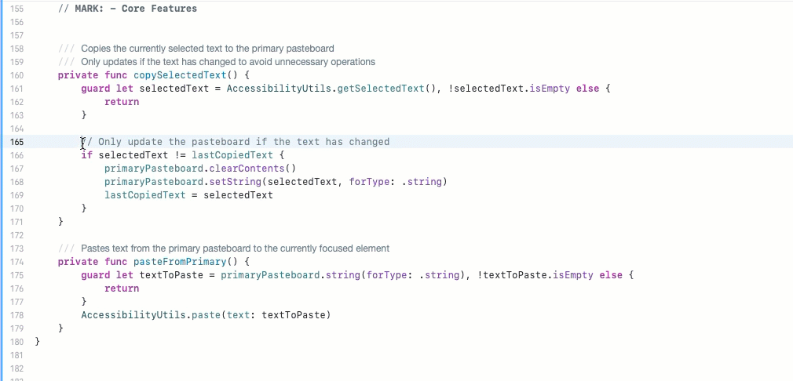

# XGhostClip

X11-style primary selection for macOS. Select text anywhere, middle-click to paste. Independent of the system clipboard.



XGhostClip replicates X11's primary selection mechanism on macOS using Core Graphics event monitoring and Accessibility APIs. Text selection automatically populates a separate pasteboard, accessible via middle-click anywhere in the system.

## Installation

**Binary**: Download from [Releases](../../releases), move to Applications, launch.

**Source**:
```bash
git clone git@github.com:afasulo/XGhostClip.git
cd XGhostClip && open PrimaryPaste.xcodeproj
```

Requires macOS 15.6+. Accessibility permissions granted automatically on first run.

## Compatibility

Works with native macOS applications that implement standard Accessibility APIs: TextEdit, Xcode, Terminal, most editors and IDEs.

**Limitation**: Cross-platform applications (Chrome, Electron apps) use custom UI frameworks that bypass `kAXSelectedTextAttribute`, breaking text selection detection.

## Implementation

- **Event Tap**: `CGEvent.tapCreate` monitors mouse clicks globally
- **Text Access**: `AXUIElement` APIs read/write selected text directly
- **Storage**: Private `NSPasteboard` maintains selection state
- **Architecture**: Menu bar daemon with minimal resource footprint

## License

MIT License. See [LICENSE](LICENSE).

---

Built by [Adam Fasulo](https://github.com/afasulo) for developers missing X11 primary selection on macOS.